# ProyectoPHP
- Proyecto php sobre tienda online -
 
Este repositorio cuenta con dos carpetas:
 
  - ProyectoPHP.
  - Capturas.
  
 <b>ProyectoPHP</b> es una carpeta comprimida donde se encuentra un primer fichero llamado "tienda.sql", el cual es la base de datos necesaria para el buen funcionamiento de la web.
  
 La carpeta contenedora con todos los ficheros .php listos para ejecutarse en un servidor local, se llama <b>"DiseñoRopa"</b>.
 Aquí se encuentran todos los scripts, estilos, imagenes necesarios.
  
  
 <h3>Capturas de la web.</h3>
  
 <h4>Capturas vista cliente:</h4>
  
 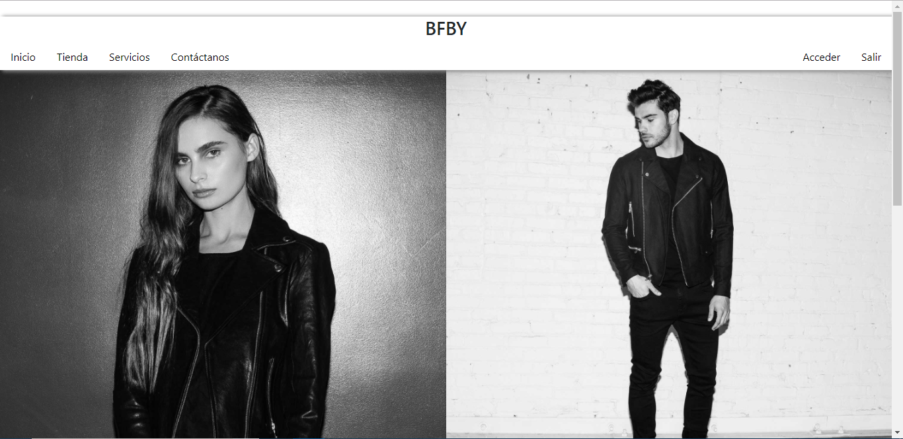
  
 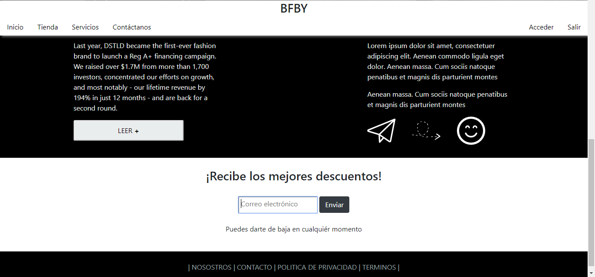
  
 
  
 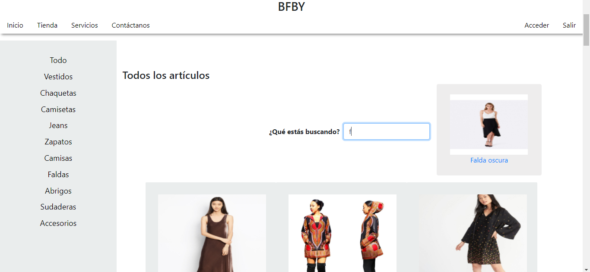
  
 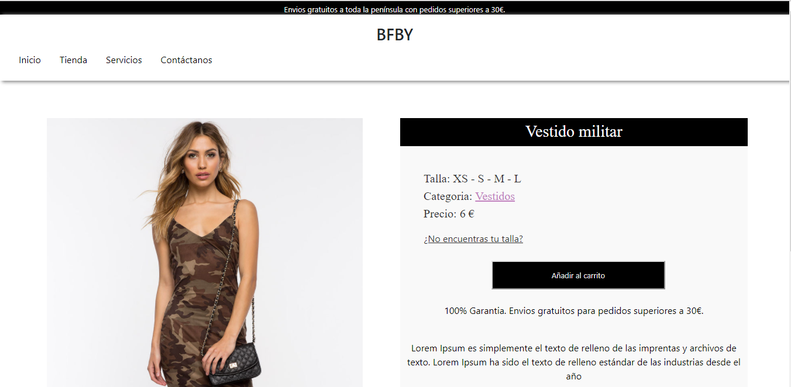
  
 
  
 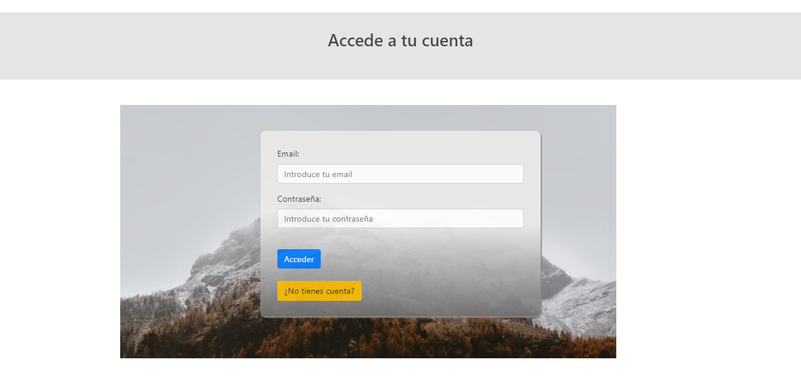
  
 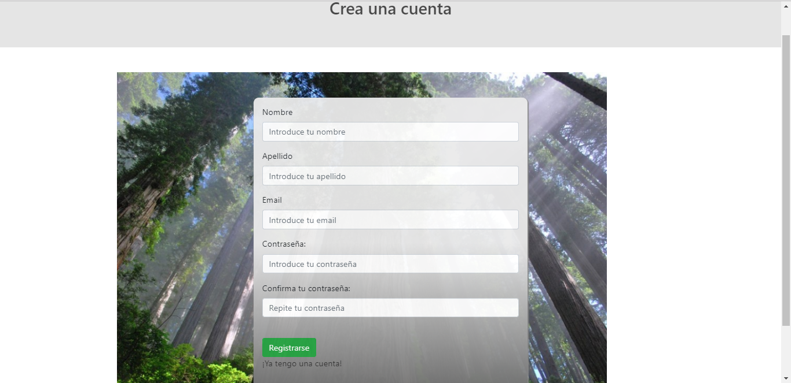
  
 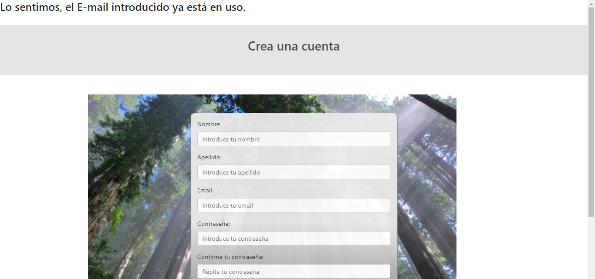
  
 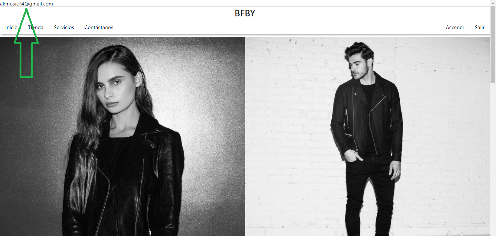
  
  
 <h4>Capturas del administrador</h4>
 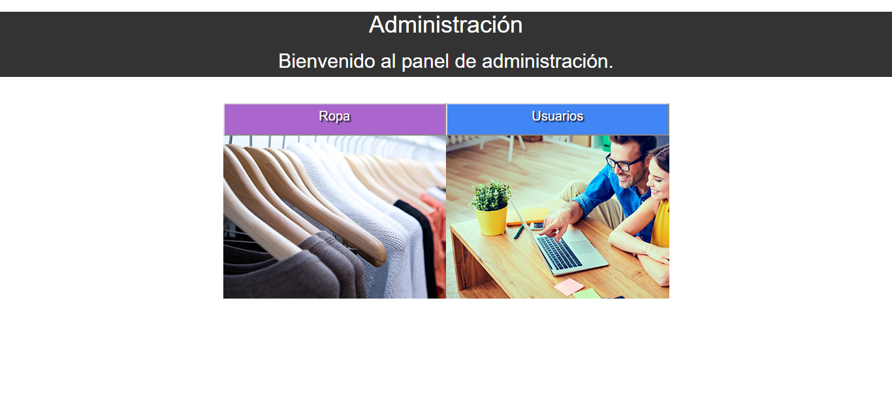
  
 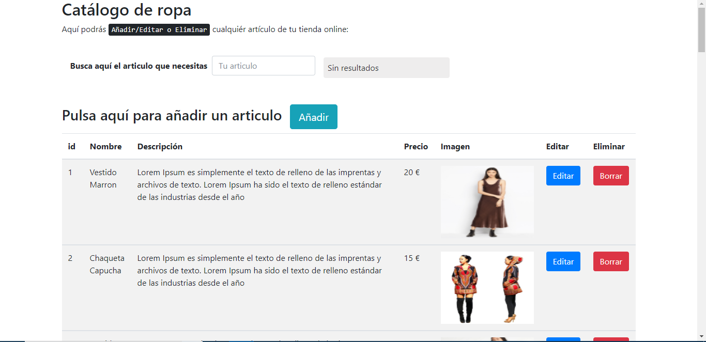
  
 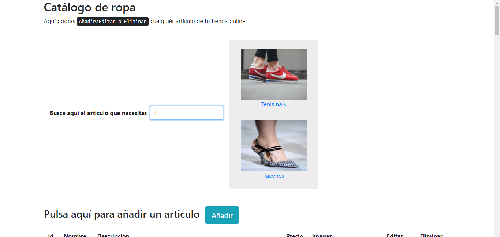
  
 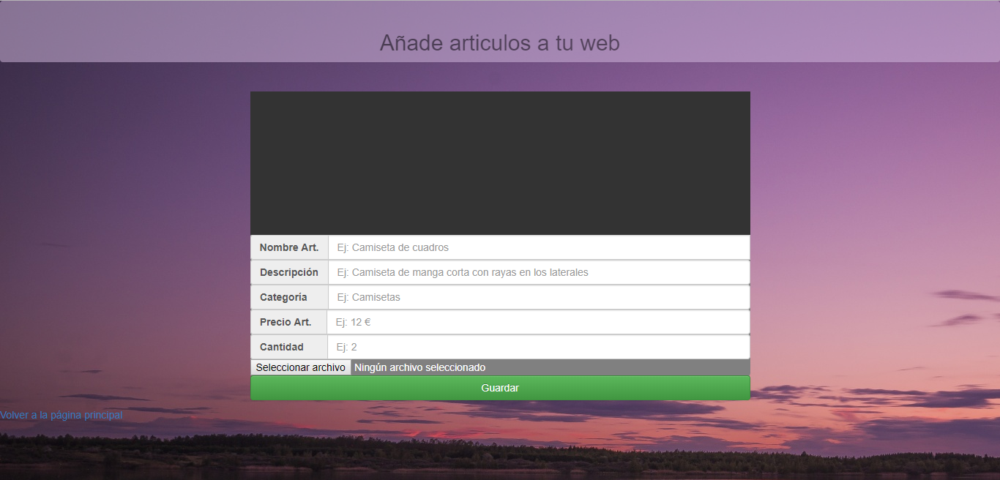
  
 
  
  
 <h4>Realizado por Ángel Castillo Flores</h4>
 
 
 
